# TurboNIGO: Structure-Preserving Neural Operators via Lyapunov-Stable Latent Dynamics

> **Anonymous Submission — ICML 2026**
> This repository accompanies the paper *"TurboNIGO: Structure-Preserving Neural Operators via Lyapunov-Stable Latent Dynamics"* (under double-blind review). NIGO stands for **Neural Infinitesimal Generator Operator**.

---

## Abstract

We propose **TurboNIGO** (Turbulent **Neural Infinitesimal Generator Operator**), a structure-preserving neural operator framework that models temporal evolution as a continuous-time dynamical system on a latent manifold. The model parameterizes the infinitesimal generator as $A = \alpha(K - K^\top) - \beta R^\top R$, a sum of skew-symmetric (energy-conserving) and dissipative components, guaranteeing **Lyapunov stability** by construction. A physics-informed inference network maps initial conditions and conditioning parameters into local basis coefficients $\{k_b, r_b\}$ and adaptive scaling parameters $\alpha, \beta$, which are composed via matrix exponential evolution $z(t) = \exp(At) \cdot z_0$ to produce future states. A multi-scale temporal refiner module further enhances long-horizon fidelity.

**Key contributions:**
- Structurally-guaranteed Lyapunov stability via the decomposition $A = \alpha(K - K^\top) - \beta R^\top R$
- Physics-conditioned operator learning with zero-shot generalization across Reynolds numbers
- Comprehensive ablation study isolating the contribution of each architectural component

---

## Datasets

This framework is benchmarked on challenging physics systems demonstrating distinct qualitative behaviors (chaotic strange attractors, limit cycles, dissipative shocks, and high-frequency waves). 

| Dataset | Description | Spatial / Temporal | Physical Attractor | Source Link |
|---------|-------------|--------------------|--------------------|-------------|
| **bc (Boundary Condition)** | Boundary Condition from CFDBench (2D Navier-Stokes) | 64×64 / 1000 steps | Limit Cycle / Transient | [CFDBench (bc.zip)](https://huggingface.co/datasets/chen-yingfa/CFDBench/blob/main/cylinder/bc.zip) |
| **KS_dataset** | Kuramoto-Sivashinsky Spatiotemporal Chaos | 512 pts / 768 steps | Strange Attractor | Generated locally |
| **Burgers** | 1D Viscous Shock Propagation | 1024 pts / 100 steps | Fixed Point (Decay) | [PDEBench (Burgers)](https://darus.uni-stuttgart.de/dataset.xhtml?persistentId=doi:10.18419/darus-2986) |
| **Shallow Waters** | 2D Non-linear wave mechanics | 128×128 / 100 steps | Multi-Varied / Waves | [PDEBench (Shallow Waters)](https://darus.uni-stuttgart.de/dataset.xhtml?persistentId=doi:10.18419/darus-2986) |

### Sample Visualizations

<details>
<summary><b>Click here to expand and explore dataset sample visualizations</b></summary>
<br>

#### Boundary Condition (bc) — CFDBench 2D Navier-Stokes

| Raw Sample Field | Energy Distribution | Spectral Analysis |
|:---:|:---:|:---:|
| 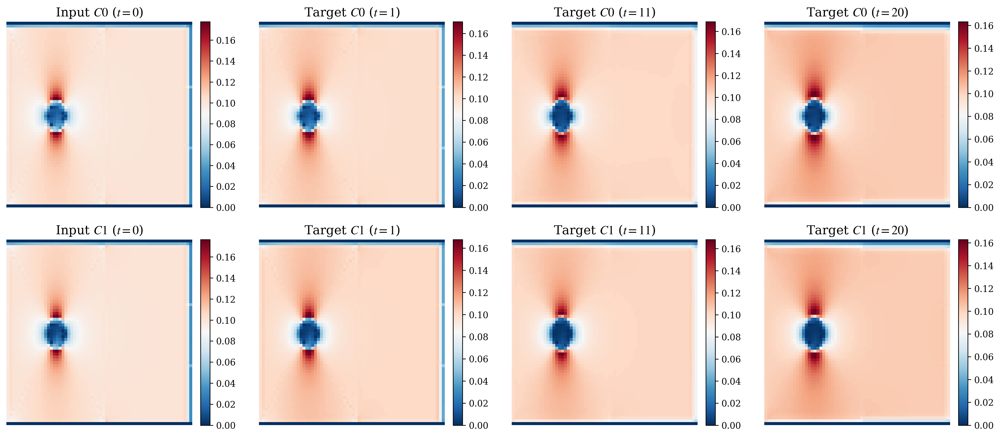 | 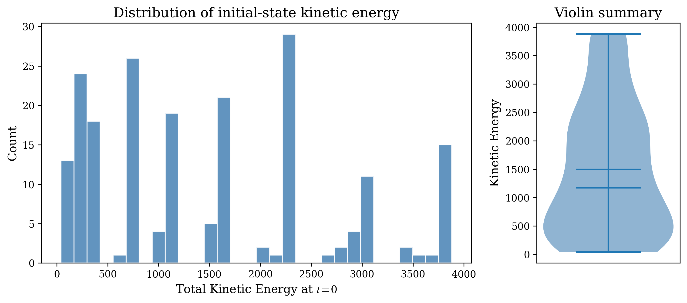 | 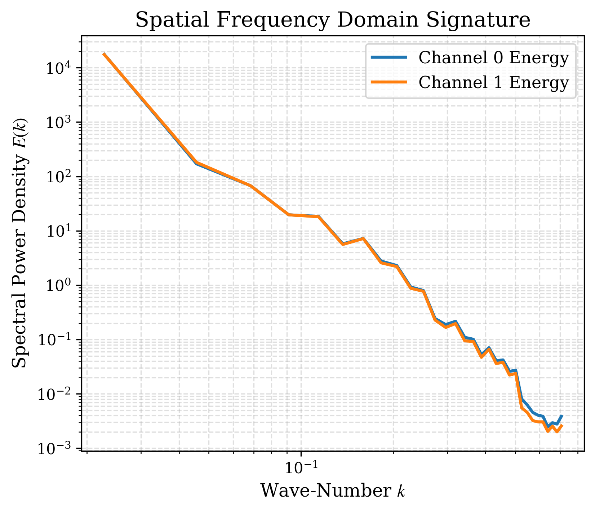 |

#### Kuramoto-Sivashinsky (KS) — Spatiotemporal Chaos

| Raw Sample Field | Energy Distribution | Spectral Analysis |
|:---:|:---:|:---:|
| 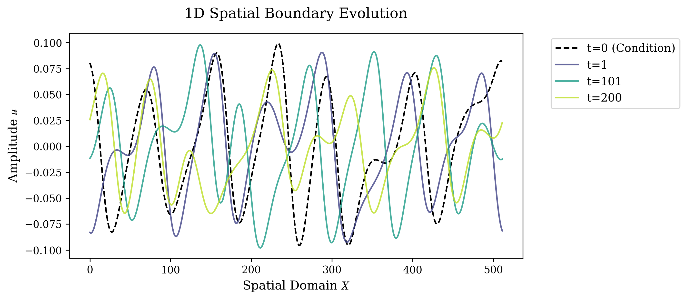 | 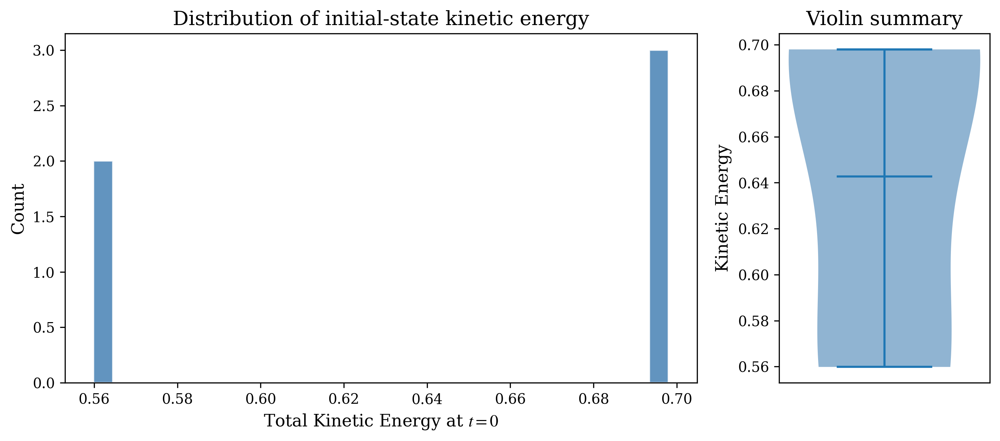 | 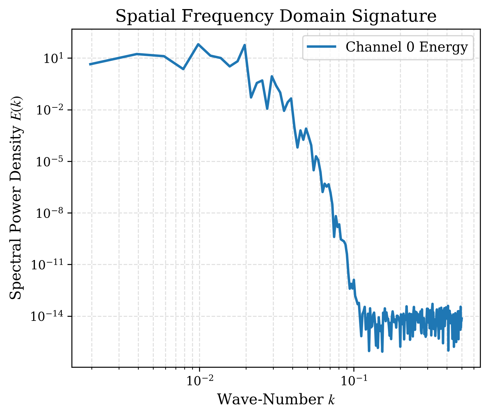 |

#### Burgers' Equation — 1D Viscous Shock Propagation

| Raw Sample Field | Energy Distribution | Spectral Analysis |
|:---:|:---:|:---:|
| 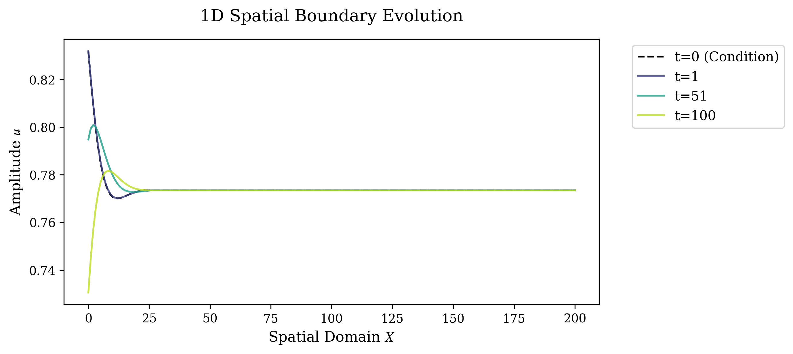 | 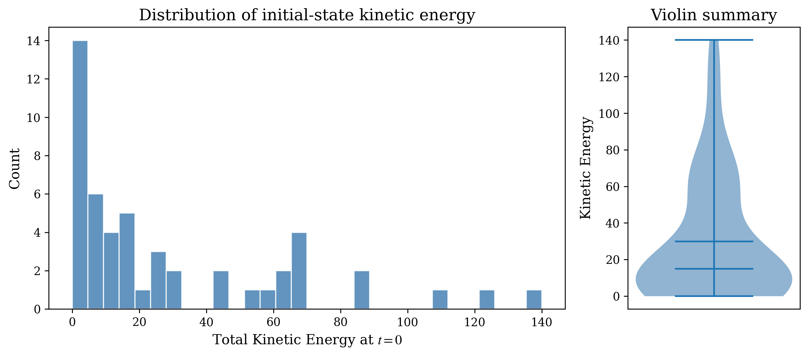 | 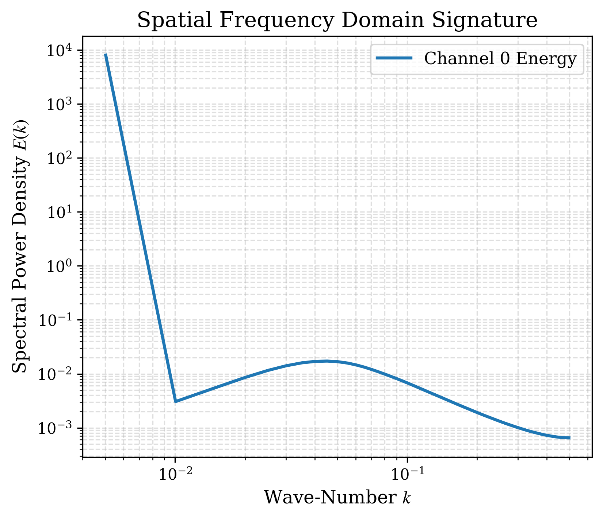 |

#### Darcy Flow — Elliptic Steady-State PDE

| Raw Sample Field | Energy Distribution | Spectral Analysis |
|:---:|:---:|:---:|
| 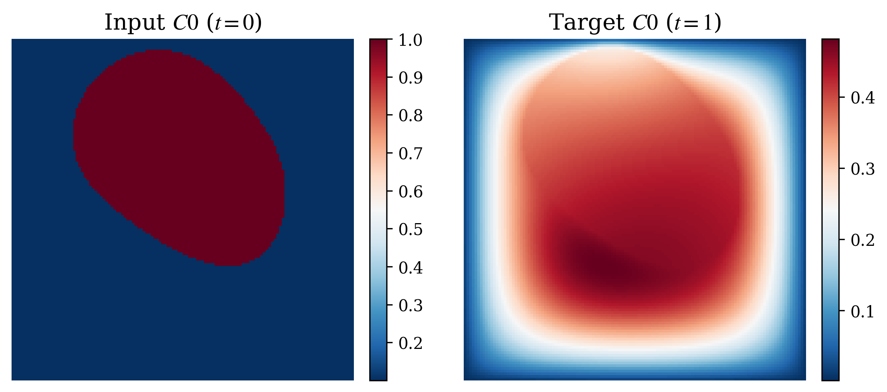 | 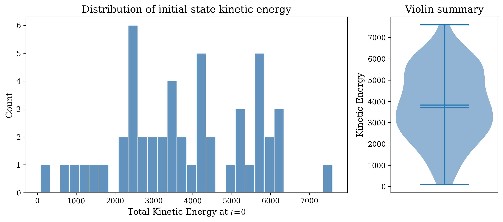 | 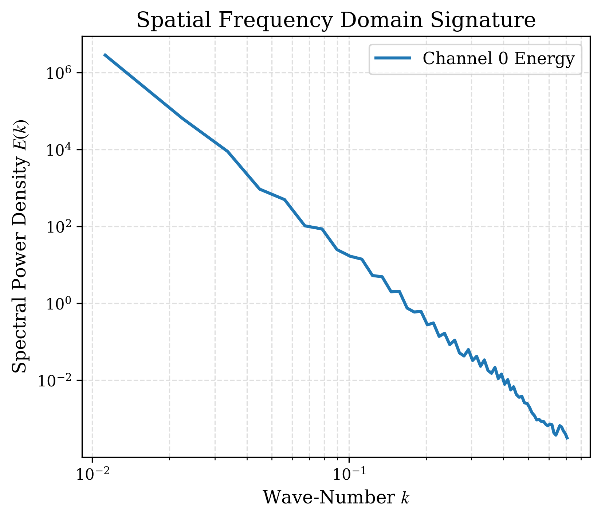 |

</details>

---

## Evaluation Results: 1D Burgers Equation (ν = 0.1)

We benchmarked TurboNIGO against official PDEBench baseline models (PINN, FNO1d, UNet1d) on the 1D Burgers equation ($\nu = 0.1$) over an extended 1,000-step autoregressive rollout. 

While baseline models suffer from non-physical energy blowup (FNO), compounding high-frequency artifacts (UNet), or frozen dynamics (PINN) over long horizons, **TurboNIGO maintains strict physical stability**. By natively structuring the viscous dissipation into a stable latent attractor, TurboNIGO achieves a final residual error ($E_{1000}$) **two orders of magnitude lower** than the baselines, while executing nearly **4$\times$ faster** at inference.

| Category | Model | $E_{1000} \downarrow$ | Time (s) | Stability |
|:---|:---|:---:|:---:|:---|
| *Baselines* | PINN | 0.8566 | 0.31 | Frozen (no dynamics) |
| | FNO1d | 0.6617 | 2.34 | Energy blowup |
| | UNet1d | 0.2282 | 2.25 | Noisy plateau |
| *TurboNIGO (Ours)* | Epoch 90 | 0.1805 | 0.61 | Stable |
| | Epoch 120 | 0.1332 | 0.59 | Stable |
| | Latest (Ep 200)| 0.0295 | 0.60 | Stable |
| | **Best (Ep 146)**| **0.0021** | **0.55** | **Stable** |

---

## Ablation Studies

### Sequence Length Ablation (Curriculum Training)

To quantify sensitivity to rollout training configurations, we ablated the sequence length during phase-1 (pure MSE) and phase-2 (Sobolev objective) curriculum training across $T_{train} \in \{10, 20, 40, 60, 80, 100\}$. We then tested the final autoregressive rollout capacity of these models out to 1,000 steps on the true 2D fluid dynamics dataset (`bc`).

Without sufficient curriculum horizons (e.g., $T=10$), the continuous model diverges rapidly over long scales. When finetuned with temporally expanding bounds ($T \ge 20$), the models rapidly acquire robust structural Lyapunov stability and systematically avert high-frequency truncation error accumulation over very long test horizons.

| Autoregressive Training Horizon | Diverged (t < 1000) | 1000-Step MSE | Final RMS Energy |
|:---:|:---:|:---:|:---:|
| $T=10$ | **Yes** | 2.09 $\times 10^{14}$ | 1.02 $\times 10^{8}$ |
| $T=20$ | **No** (Stable) | 0.509 | 4.66 |
| $T=40$ | **No** (Stable) | 0.592 | 4.56 |
| $T=60$ | **No** (Stable) | 0.425 | 4.87 |
| $T=80$ | **No** (Stable) | 0.554 | 4.59 |
| $T=100$ | **No** (Stable) | 0.519 | 4.68 |

| Long-Term Autoregressive Energy Divergence | Snapshot Predictions ($t=1000$) |
|:---:|:---:|
| 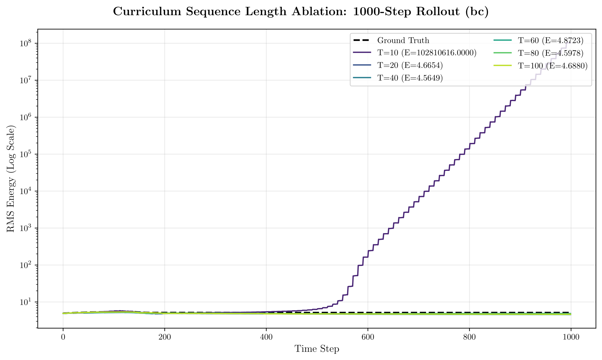 | 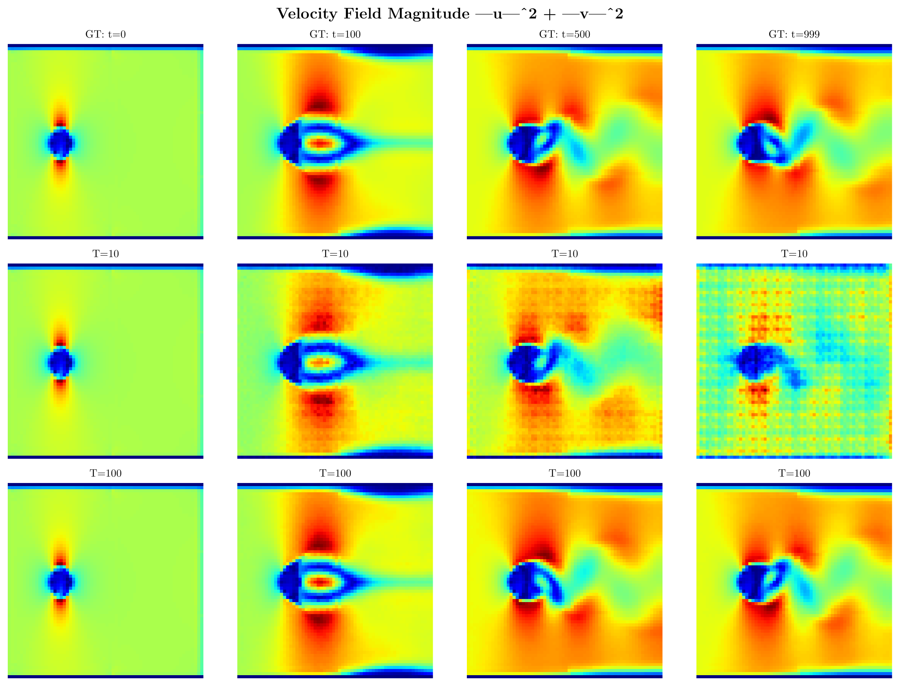 |

### Component Isolation (Lyapunov Architecture)
The full ablation suite isolates the specific mathematical operations within the hyper-turbulent continuous generator matrix $A = \alpha(K-K^\top) - \beta R^\top R$.

| Ablation Name | Structural Modification | Generator Math ($A$) |
|---------------|-------------------------|--------------------------|
| **Baseline** | Full TurboNIGO Model | $A = \alpha(K-K^\top) - \beta R^\top R$ |
| **No Skew (Abl 1)** | Eliminate conservative momentum | $A = -\beta R^\top R$ (Pure Dissipation) |
| **No Dissipative (Abl 2)** | Eliminate energy regularization | $A = \alpha(K-K^\top)$ (Pure Conservative) |
| **Dense Generator (Abl 3)** | Dense unconstrained weights | $A = \text{MLP}(z_0)$ |
| **No Refiner (Abl 4)** | Skip multi-scale temporal convs | $z_{refined} = z_{base}$ |
| **Unscaled (Abl 5)** | Force scalars perfectly to 1 | $A = (K-K^\top) - R^\top R$ |

<p align="center">
  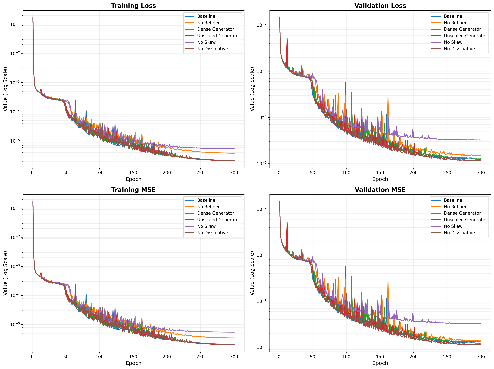
</p>

---

## Repository Structure

```
.
├── turbo_nigo/                     # Core framework
│   ├── configs/                    # YAML configuration files
│   │   ├── default_config.yaml     # Bluff-body cylinder flow config
│   │   └── ks_config.yaml          # Kuramoto-Sivashinsky config
│   ├── core/
│   │   └── trainer.py              # Research-grade training loop with full resumability
│   ├── data/
│   │   ├── base_dataset.py         # Abstract dataset interface
│   │   ├── flow_dataset.py         # In-memory 2D flow dataset (cylinder)
│   │   ├── h5_dataset.py           # HDF5 high-resolution dataset loader
│   │   └── analyzer.py             # Dataset visualization & statistics
│   ├── models/
│   │   ├── encoder.py              # Convolutional encoder
│   │   ├── decoder.py              # Transposed-conv decoder
│   │   ├── physics_net.py          # Physics inference network (basis coefficients)
│   │   ├── generator.py            # Hyper-turbulent Lie-algebraic generator
│   │   ├── refiner.py              # Multi-scale temporal refinement
│   │   ├── turbo_nigo.py           # Composite model (GlobalTurboNIGO)
│   │   ├── ablations/              # Ablation-specific subclasses
│   │   │   ├── generator_ablations.py
│   │   │   └── model_ablations.py
│   │   └── extensions/             # Advanced extensions (attention-based physics)
│   └── utils/
│       ├── logger.py               # Multi-backend experiment logger
│       ├── misc.py                 # Seeding, path utilities
│       └── registry.py             # Dataset/model registry
├── scripts/
│   ├── train.py                    # Standard training entry point
│   ├── evaluate.py                 # Checkpoint evaluation
│   ├── run_ablations.py            # Component ablation suite (cylinder flow)
│   ├── run_ablations_ks.py         # Component ablation suite (Kuramoto-Sivashinsky)
│   ├── run_sensitivity.py          # Dataset scale × horizon sensitivity analysis
│   ├── visualize_bc_dataset.py     # Publication figures for cylinder flow
│   └── visualize_ks_dataset.py     # Publication figures for KS equation
├── tests/                          # Unit & integration tests
│   ├── test_math_properties.py     # Skew-symmetry, energy boundedness, Lyapunov
│   ├── test_ablations.py           # Ablation variant correctness
│   ├── test_models.py              # Forward pass shape validation
│   ├── test_extensions.py          # Attention physics & dynamic resolution
│   ├── test_integration.py         # End-to-end pipeline tests
│   └── ...
└── .gitignore
```

---

## Requirements

- Python ≥ 3.10 (tested on 3.13)
- PyTorch ≥ 2.10 with CUDA (tested on cu130)
- NVIDIA GPU with compatible drivers

**Option A — Conda (recommended):**

```bash
conda env create -f environment.yml
conda activate turbo_nigo
```

**Option B — pip:**

```bash
python -m venv .venv
.venv\Scripts\activate                # Windows
# source .venv/bin/activate           # Linux/macOS

# Install PyTorch with CUDA first (adjust cu130 to your CUDA version):
pip install torch==2.10.0+cu130 torchvision==0.25.0+cu130 --extra-index-url https://download.pytorch.org/whl/cu130

# Install remaining dependencies:
pip install -r requirements.txt
```

**Verify GPU:**

```bash
python -c "import torch; assert torch.cuda.is_available(), 'No GPU detected'; print(f'GPU: {torch.cuda.get_device_name(0)}, CUDA: {torch.version.cuda}')"
```

---

## Datasets

This framework is evaluated on two benchmark systems of increasing complexity:

| Dataset | Type | Spatial | Temporal | Samples | Size |
|---------|------|---------|----------|---------|------|
| **Bluff-body Cylinder Flow** | 2D Navier-Stokes | 64×64, 2 channels ($u$, $v$) | 1000 steps | 50 cases | ~500 MB |
| **Kuramoto-Sivashinsky** | 1D chaotic PDE | 512 points | 768 steps | 40,000 trajectories | ~88 GB |

Place datasets in `./datasets/` following the structure:
```
datasets/
├── bc/                          # Cylinder flow
│   ├── case000/
│   │   ├── u.npy                # (T, H, W) velocity x-component
│   │   ├── v.npy                # (T, H, W) velocity y-component
│   │   └── case.json            # {Re, radius, inlet_velocity, bc_type}
│   └── ...
└── KS_dataset/
    ├── KS_ML_DATASET.h5         # train: (40000, 768, 512), test: (10000, 768, 512)
    └── KS_GROUNDTRUTH.h5        # 9 long reference trajectories
```

---

## Training

**Standard training** (cylinder flow):
```bash
python scripts/train.py --config turbo_nigo/configs/default_config.yaml
```

**Resuming** from a checkpoint:
```bash
python scripts/train.py --config turbo_nigo/configs/default_config.yaml --resume_from results/checkpoints/ep050.pth
```

Key configuration flags in `default_config.yaml`:

| Parameter | Default | Description |
|-----------|---------|-------------|
| `epochs` | 300 | Training epochs |
| `batch_size` | 64 | Mini-batch size |
| `learning_rate` | 2e-4 | AdamW learning rate |
| `latent_dim` | 64 | Latent space dimension |
| `num_bases` | 8 | Number of Lie-algebra basis matrices $K_b$ |
| `scheduler` | cosine | LR schedule (cosine/plateau/step) |
| `tf32` | true | TensorFloat-32 acceleration |
| `use_amp` | true | Automatic mixed precision |

---

## Ablation Study

The ablation suite quantifies the contribution of each architectural component independently, without modifying the core framework code.

### Component Ablations

| Ablation | What Changes | Mathematical Effect |
|----------|-------------|-------------------|
| **Baseline** | Full TurboNIGO | $A = \alpha(K-K^\top) - \beta R^\top R$ |
| **No Skew (Abl. 1)** | Remove $K-K^\top$ | $A = -\beta R^\top R$ (purely dissipative) |
| **No Dissipative (Abl. 2)** | Remove $R^\top R$ | $A = \alpha(K-K^\top)$ (energy-conserving only) |
| **Dense Generator (Abl. 3)** | Bypass structured factorization | $A = \text{MLP}(z_0)$ (unconstrained) |
| **No Refiner (Abl. 4)** | Skip temporal refinement | $z_{\text{refined}} = z_{\text{base}}$ |
| **Unscaled Generator (Abl. 5)** | Force $\alpha=1, \beta=1$ | $A = (K-K^\top) - R^\top R$ (fixed scale) |

**Run ablations:**
```bash
# Cylinder flow
python scripts/run_ablations.py --config turbo_nigo/configs/default_config.yaml

# Kuramoto-Sivashinsky
python scripts/run_ablations_ks.py --config turbo_nigo/configs/ks_config.yaml
```

### Sensitivity Analysis

Grid search over dataset scale and prediction horizon:
```bash
python scripts/run_sensitivity.py --config turbo_nigo/configs/default_config.yaml
```

| Factor | Values Tested |
|--------|--------------|
| Dataset Scale $N$ | 10, 25, 50 cases |
| Temporal Horizon $T$ | 10, 20, 40 steps |

---

## Model Architecture

```
┌──────────────┐     ┌──────────────────┐     ┌─────────────────────┐
│  Input u₀    │────▶│   Encoder E(·)   │────▶│   Latent z₀         │
│  (C, H, W)   │     │  Conv layers     │     │   (latent_dim,)     │
└──────────────┘     └──────────────────┘     └────────┬────────────┘
                                                       │
                           ┌───────────────────────────┘
                           ▼
               ┌───────────────────────┐
               │  PhysicsInferenceNet  │◀── Conditions c (Re, radius, ...)
               │  MLP → basis coeffs  │
               └───────────┬───────────┘
                           │ {c_b}
                           ▼
               ┌───────────────────────┐
               │  HyperTurbulentGen.   │    A = α(K-Kᵀ) - βRᵀR
               │  Infinitesimal Gen.   │    (skew-symm. + dissipative)
               │  z(t) = expm(At)·z₀  │    Lyapunov stable ✓
               └───────────┬───────────┘
                           │ z(t₁), ..., z(tₜ)
                           ▼
               ┌───────────────────────┐
               │  TemporalRefiner      │
               │  Multi-scale residual │
               └───────────┬───────────┘
                           │
                           ▼
               ┌───────────────────────┐     ┌──────────────┐
               │   Decoder D(·)        │────▶│  Output û(t) │
               │  Transposed conv      │     │  (T, C, H, W)│
               └───────────────────────┘     └──────────────┘
```

**Model size:** ~3.27M parameters (12.5 MB in FP32)

| Component | Parameters | Share |
|-----------|-----------|-------|
| Encoder | 1,290,400 | 39.5% |
| Decoder | 1,297,186 | 39.7% |
| Temporal Refiner | 590,720 | 18.1% |
| Generator | 65,536 | 2.0% |
| Conditioning Net | 26,576 | 0.8% |

---

## Visualization

Generate publication-quality figures (PNG + PDF):

```bash
# Cylinder flow: vorticity fields, energy spectra, KE evolution, etc.
python scripts/visualize_bc_dataset.py --output_dir ./figures/bc

# Kuramoto-Sivashinsky: x-t diagrams, spatial spectra, autocorrelation, etc.
python scripts/visualize_ks_dataset.py --output_dir ./figures/ks
```

---

## Testing

Run the full test suite to verify mathematical properties and pipeline integrity:

```bash
pytest tests/ -v
```

Key test categories:
- **`test_math_properties.py`** — Skew-symmetry of $L_s$, negative semi-definiteness of $L_d$, energy boundedness
- **`test_ablations.py`** — Forward pass correctness for all 5 ablation variants
- **`test_models.py`** — Output shape validation across all sub-modules
- **`test_integration.py`** — End-to-end training pipeline on synthetic data

---

## Compute Optimizations

The framework includes several optimizations for high-throughput training on modern GPUs:

| Optimization | Config Flag | Effect |
|-------------|-------------|--------|
| TensorFloat-32 | `tf32: true` | ~2× matmul speedup on Ampere/Ada |
| cuDNN Benchmark | `cudnn_benchmark: true` | Auto-tuned conv kernels |
| Mixed Precision | `use_amp: true` | FP16 forward, FP32 gradients |
| Persistent Workers | Built-in | Zero inter-epoch data-loader overhead |
| `torch.compile()` | `compile: true` | Graph-mode optimization (Linux/WSL) |

---

## Citation

```
Under double-blind review. Citation will be provided upon acceptance.
```

---

## License

This code is provided for **anonymous peer review only**. Redistribution is not permitted during the review period.
